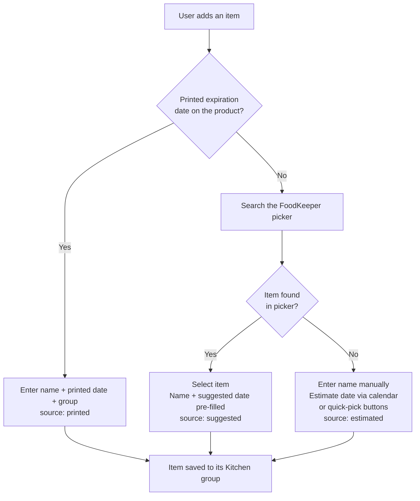

# Food Expiry Tracker Specifications

**Version:** 1.4
**Author:** Talia Sirianni
**Created on:** 7/3/2026

## Changelog

| Date     | Author         | Change Description                                                                                                                                        |
| -------- | -------------- | --------------------------------------------------------------------------------------------------------------------------------------------------------- |
| 7/3/2026 | Talia Sirianni | Published the first version                                                                                                                               |
| 7/4/2026 | Talia Sirianni | Added criticism received by family when I first pitched this project + plans to address each point                                                        |
| 7/4/2026 | Talia Sirianni | Updated the users section with an identified target audience                                                                                              |
| 7/4/2026 | Talia Sirianni | Rewrote the no-expiration-date flow to use a picker (no fuzzy matching), added date source tracking, added the user flow chart, cleaned up open questions |
| 7/4/2026 | Talia Sirianni | ER schema plan, resolution log with snapshot fields, delete-logging rule, group-deletion rule (open question 5).                                          |

## Problem

- Food expires in my pantry, fridge, freezer, etc. unnoticed.
- There's no tracking system.
- My memory fails, and sticky/paper notes are too messy.
- Digital notes are a hassle to maintain with typical notetaking apps like notepad, your phone's notes app, or even more advanced options like Obsidian.

## User(s)

- Me (user #1); currently tracks nothing
- My family could test this
- Younger people looking to avoid wasting money on food/drink that they fail to consume on time
  - In the current economy I imagine this looks appealing. Later versions of this project should present metrics and recommendations to save money based on habits?

## Core concept

- Present a Virtual Kitchen that the user can access to model and manage their inventory as well as track expiration of items
- Divide food inventory into user-created groups modeling their real storage (fridge, pantry, freezer, etc.)

## User Flow (Adding New Items)

An expiration date is always required. No dateless items are allowed. Every item also records where its date came from: `printed`, `suggested`, or `estimated`.

### When an Expiration Date is Present

1. User goes to add a new/existing product to their virtual kitchen (they could be in the grocery store/updating their app with their current inventory/etc.)
2. User enters manually
   - Name
   - Expiration Date (source: `printed`)
   - Group in the Kitchen the Item goes (Fridge, Pantry, etc.)
3. Virtual Kitchen (the correct group) is updated with the added product

### When an Expiration Date is Not Present

1. User goes to add a new/existing product to their virtual kitchen
2. User selects "No Printed Expiration Date"
3. A searchable picker of USDA FoodKeeper items appears. The user searches and selects, they are not typing a free-text name that the app tries to match behind the scenes. That would be fuzzy matching, which is out of scope for V1
   - **If the user finds their item in the picker**
     - Selecting it fills in the name and pre-fills a suggested expiration date based on the item's storage group (source: `suggested`)
   - **If the item isn't in the picker**
     - User enters the name manually and estimates a date from the calendar or quick-pick buttons (3 days, 1 week, 2 weeks, 1 month) (source: `estimated`)
4. Virtual Kitchen (the correct group) is updated with the added product



## Core features

- Create/edit/delete kitchen groups
- Item entry: name + expiry date + group
- Each item records its date source: `printed`, `suggested`, or `estimated` (cheap to store now, powers V2 insights later)
- Item list (inventory) should be sorted by soonest-expiring
- "Expired" status is derived (expiry_date < today), never a stored flag (which would be redundant and fail to sync accurately). Calculation is preferred, automated and reliable
- Expiration View of Inventory: all expired items across groups in one list, showing each item's group

## Notifications

- Alert the day before expiry
- Snooze: re-alert in 24h; if item expires tomorrow, re-alert at midnight instead
- One final notification on expiry day, then silence
- Expired items keep a persistent visual state until resolved (a red highlight)

## Item resolution

Consume, discard, or delete: all remove the item; distinction logged for v2 waste stats (besides delete which gets filtered out of waste stats but is still logged in the system)

## Data for Suggestions Feature

USDA FoodKeeper dataset (400+ items, shelf life by storage method), bundled locally as JSON. It is offline, no third-party API dependency. The picker pre-fills a suggested expiry date based on the item's storage group.

- https://catalog.data.gov/dataset/fsis-foodkeeper-data

## ER Diagram (Schema Plan)

> For V1, the design will assume I am the sole user using this app on my phone.

**Entities**

- **Items**
  - item_id
  - group_id
  - name
  - expiration_date
  - date_source (CHECK that date_source is either "printed", "suggested" or "estimated")
  - added_at
  - snoozed_until (nullable for if snooze is never used)

> Note that expiration will be derived (is expiration_date? < today?)

- **FoodGroups**
  - group_id
  - name
  - created_at

> FoodGroups cannot be deleted if they are not empty. Users must resolve all its items first (consume, discard, move, delete)

- **ResolutionLog** // For what happens to added items (consumed or discarded?)
  - log_id
  - item_name
  - group_name
  - resolution_type (CHECK that resolution_type is either "consumed", "discarded", or "deleted")
  - resolved_at

> I am opting to use ResolutionLog to follow single responsibility principle and distinguish logs from the current active data that the user is tracking

**Diagram**

```mermaid

```

## Features Not in V1 MVP

- Barcode scanning (barcodes don't encode expiry dates)
- Fuzzy-matching typed names to FoodKeeper (picker only)
- Dateless items
- Recipe suggestions
- Photos
- Sharing/multi-user
- Waste stats

## Platform/Techstack

- React Native + Expo
  - iOS, Android, web from one codebase
- Push notifications on mobile; in-app "expiring soon" banner on web

Selected due to platform support and previous experience with React. I desire a mobile version of this app that is also presentable on a web browser.

## Portfolio artifacts (Talia's Personal Goals for Career Development)

- Live web demo link
- 30-sec demo GIF in README
- DESIGN.md: show the evolution of this project's design

## Criticism of Concept + Potential Solutions

- **No one will want to manually update the app to map everything they have in their kitchen. Manual data entry is an app killer**
  - **Solution:** Present the app as a way to track "tonight's groceries" or "my 5 most at risk perishables"

- **Not everyone will want to use an app to solve this problem. Lots of people sniff their food/manually check the date and call it a day. This idea is a 'dud' because no one will use it with what's already available**
  - **Rationale:** I am living proof that there's an audience for an app solution. The sniff test drives me nuts. I cannot keep dates in my head on top of everything. I acknowledge that my app won't appeal to everyone but there's most certainly an appeal to _younger people who are trying to save money and want to avoid wasting their purchases._ I should target an audience that has frequently lost money due to not eating/drinking their purchases before they expire.

## Success Metrics: How do I measure V1's progress?

After 2 weeks of daily use, I've logged ≥ 10 items and rescued ≥ 1 item I'd otherwise have forgotten

- If this app helps me solve my problem visually with numbers, I will know I have achieved my goal for myself as the user

## Open Questions during the Development Process

1. How long should the snooze duration be for expiration reminders?
   - **Resolved:** 24h re-alert. If the item expires tomorrow, re-alert at midnight instead so the alert never lands after the food has already expired
2. Who should my target audience be besides myself if I ever wanted to share this app?
   - **Partially resolved:** younger people trying to save money who have repeatedly lost purchases to expiry (see Users + Criticism sections). Still open beyond that
3. How can I prevent turning people off the app with overwhelming data entry of their entire kitchen inventory?
   - **Partially resolved:** frame onboarding as "tonight's groceries" or "my 5 most at risk perishables" instead of a full kitchen inventory. The kitchen fills up incrementally as I shop
4. What are the most useful quick-pick date options and what general storage advice should the tooltips give (ex: what works best for produce vs. meats)?
   - **TBD (Unresolved):** Needs research as of writing this note
5. Can users delete a food group when items still exist in that food group?
   - **Resolved:** No. The user must move, consume, discard or delete each item in that food group before it can be deleted.
